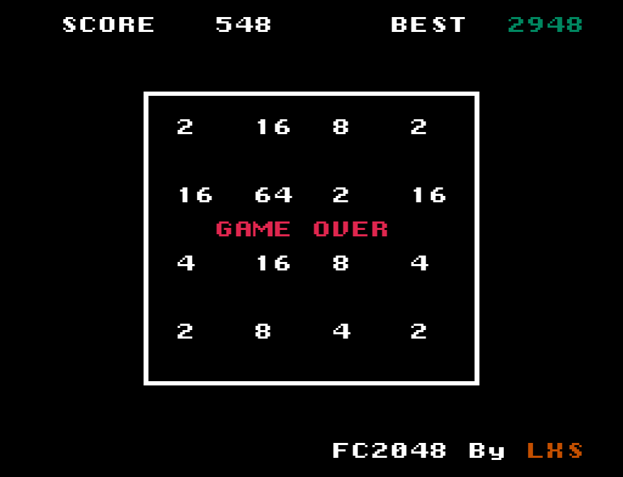

# fc2048

2048 游戏 NES 移植版，使用 cc65 工具链（C/汇编混合）开发。



## neslib 介绍

| 路径 | 说明 |
|------|------|
| `src/` | 源码（`.c`、`.h`、`.s`、`.chr`） |
| `neslib/` | NES 库（crt0、neslib、famitone2） |
| `src/nes.cfg` | 链接器内存布局配置 |
| `build.sh` | 构建脚本 |
| `build/` | 编译输出目录 |

`neslib/` 是 Shiru 编写、Lauri Kasanen 维护的 NES 汇编函数库（zlib 许可），为 cc65 C 代码提供硬件抽象层，功能涵盖：

- **调色板**：`pal_all`、`pal_bg`、`pal_spr`、`pal_col`、`pal_clear`、`pal_bright` 等
- **PPU 控制**：`ppu_wait_nmi` / `ppu_wait_frame`（帧同步）、`ppu_off` / `ppu_on_all`（渲染开关）、`ppu_system`（检测 PAL/NTSC）
- **精灵（Sprite）**：`oam_clear`、`oam_spr`（单个精灵）、`oam_meta_spr`（元精灵）、`oam_hide_rest`
- **音乐音效**：基于 FamiTone2 的 `music_play` / `music_stop` / `music_pause`、`sfx_play`、`sample_play`
- **手柄输入**：`pad_poll`（实时状态）、`pad_trigger`（仅按下瞬间）、`pad_state`（上一帧状态）
- **VRAM 读写**：`vram_adr`、`vram_put`、`vram_write`、`vram_read`、`vram_fill`，以及 `set_vram_update`（渲染开启时的异步更新系统）
- **压缩解压**：`vram_unrle`（RLE）、`vram_unlz4`（LZ4）
- **滚动与分屏**：`scroll`、`split`
- **杂项**：`rand8` / `rand16` / `set_rand`（随机数）、`delay`（帧延迟）、`memfill`

## 构建

依赖 [cc65](https://github.com/cc65/cc65) 工具链。

### 编译安装 cc65

```bash
git clone https://github.com/cc65/cc65.git ../cc65
cd ../cc65
make
cd ../fc2048
```

编译后 `../cc65/bin/` 目录下包含所有工具，`../cc65/lib/` 目录下包含运行时库。

### 编译 ROM

```bash
./build.sh
```

产物：`build/rom.nes`

## 运行

推荐模拟器：[Mesen](https://www.mesen.ca/)、[FCEUX](http://www.fceux.com/)。

```
mesen build/rom.nes
```

## 操作

- 方向键：移动方块（上/下/左/右）
- Start：重新开始

## 许可

代码部分使用 MIT 许可。`neslib/` 目录下的第三方库遵循其各自许可。

## 致谢

- `src/tiles.chr` 基于 [nes-starter-kit](https://github.com/igwgames/nes-starter-kit) 的 `graphics/tiles.chr` 修改而来。